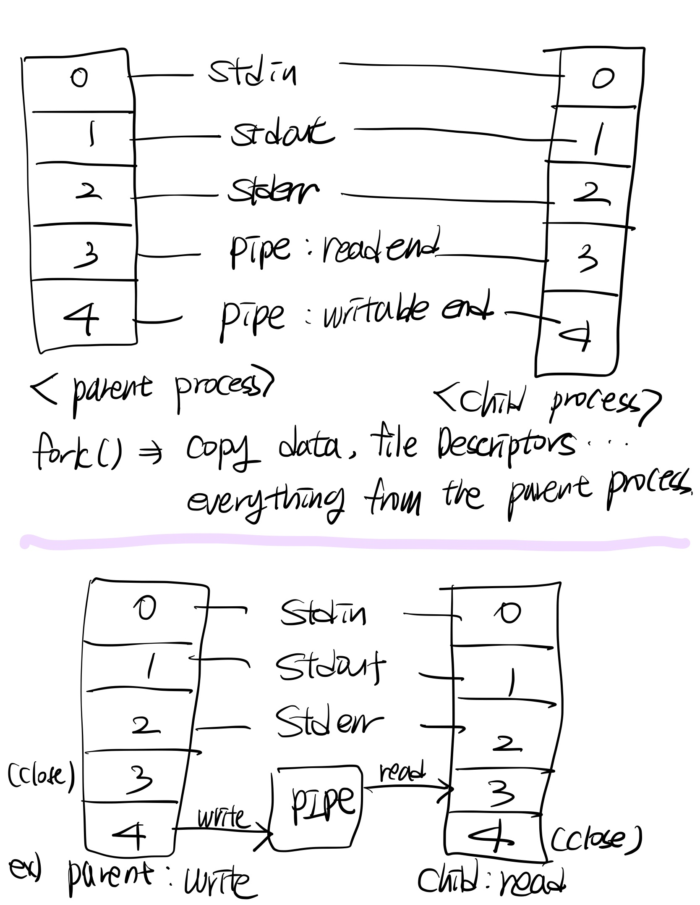

# Pipex : Replicates the functionality of the shell command pipeline!

<details>
<summary>External functions</summary>
<div markdown="1">

open, close, read, write, malloc, free, perror, strerror, access, 
dup, dup2, execve, exit, fork, pipe, unlink, wait, waitpid    

- open () : The open() function is used in C programming language to open a file and get a file descriptor that can be used for reading, writing or both. The function takes two main arguments: the file name and a set of flags to specify the mode in which the file should be opened. Here are some of the commonly used options for the open() function:  

	O_RDONLY: Opens the file in read-only mode.  
	O_WRONLY: Opens the file in write-only mode.  
	O_RDWR: Opens the file in read/write mode.  
	O_CREAT: Creates the file if it does not exist.  
	O_TRUNC: Truncates the file to zero length if it already exists.  
	O_APPEND: Appends data to the end of the file.  
	O_EXCL: Creates the file exclusively, meaning that if the file already exists, the open operation fails.  

```c
#include <fcntl.h>
#include <stdio.h>

int main() {
    int fd = open("myfile.txt", O_CREAT | O_WRONLY | O_TRUNC, 0644);
    if (fd < 0) {
        perror("open");
        return 1;
    }
    // Do something with the file...
    close(fd);
    return 0;
}
```

- perror(): This function is used to print an error message to the console.  
```c
perror("Error message");
```

- strerror(): This function is used to get a string describing the error code passed as an argument.  
```c
char *errorString = strerror(errno);
printf("Error message: %s\n", errorString);
```

- access(): This function is used to check if a file or directory can be accessed.  
```c
int result = access("file.txt", R_OK);
if (result == -1) {
   perror("Error accessing file");
   exit(EXIT_FAILURE);
}
```

- dup(): This function is used to duplicate a file descriptor.  
```c
int fd2 = dup(fd);
if (fd2 == -1) {
   perror("Error duplicating file descriptor");
   exit(EXIT_FAILURE);
}
```

- dup2(): This function is used to duplicate a file descriptor to a specified file descriptor.  
```c
int fd2 = dup2(fd, STDOUT_FILENO);
if (fd2 == -1) {
   perror("Error duplicating file descriptor");
   exit(EXIT_FAILURE);
}
```

- execve(): This function is used to replace the current process with a new process.  
```c
char *args[] = {"ls", "-l", NULL};
execve("/bin/ls", args, NULL);
perror("Error executing program");
exit(EXIT_FAILURE);
```

- fork(): This function is used to create a new process.  
```c
pid_t childPid = fork();
if (childPid == -1) {
   perror("Error forking process");
   exit(EXIT_FAILURE);
}
if (childPid == 0) {
   // Child process
} else {
   // Parent process
}
```

- pipe(): This function is used to create a pipe for interprocess communication.  
```c
int pipefd[2];
int result = pipe(pipefd);
if (result == -1) {
   perror("Error creating pipe");
   exit(EXIT_FAILURE);
}
```

- unlink(): This function is used to delete a file.   
```c
int result = unlink("file.txt");
if (result == -1) {
   perror("Error deleting file");
   exit(EXIT_FAILURE);
}
```

- wait(): This function is used to wait for a child process to terminate.   
```c
pid_t childPid = fork();
if (childPid == -1) {
   perror("Error forking process");
   exit(EXIT_FAILURE);
}
if (childPid == 0) {
   // Child process
   exit(EXIT_SUCCESS);
} else {
   // Parent process
   int status;
   pid_t result = wait(&status);
   if (result == -1) {
      perror("Error waiting for child process");
      exit(EXIT_FAILURE);
   }
   if (WIFEXITED(status)) {
      printf("Child process exited with status %d\n", WEXITSTATUS(status));
   }
}
```

- waitpid(): This function is used to wait for a specific child process to terminate.   
```c
pid_t childPid = fork();
if (childPid == -1) {
   perror("Error forking process");
   exit(EXIT_FAILURE);
}
if (childPid == 0) {
   // Child process
   exit(EXIT_SUCCESS);
} else {
   // Parent process
   int status;
   pid_t result = waitpid(childPid, &status, 0);
   if (result == -1) {
      perror("Error waiting for child process");
      exit(EXIT_FAILURE);
   }
   if (WIFEXITED(status)) {
      printf("Child process exited with status %d\n", WEXITSTATUS(status));
   }
}
```

</div>
</details>

## What is a Process?
A process is an executing program with a unique process identifier (PID) assigned by the operating system when it is started. Each process has its own virtual memory space, including its allocated memory, stack and heap.  

## What are IPC Mechanisms?

Interprocess communication (IPC) mechanisms allow processes to communicate and share data with each other. Some common IPC mechanisms are pipes, message queues and shared memory. Pipes are a simple form of IPC that allow unidirectional data flows between two processes, where one process writes data to the pipe and the other reads from the pipe.  

Processes can communicate with each other using IPC mechanisms such as pipes, message queues and shared memory. Pipes are a simple form of IPC that allow two processes to communicate via a unidirectional stream of data. One process writes data to the pipe and the other reads data from the pipe.   

- Pipes: Unidirectional communication channels for transferring data between processes.    

- Named pipes (FIFOs): Similar to pipes, but can be used between unrelated processes, identified by a name in the file system.  

- Message queues: A method of exchanging messages between processes, managed by the operating system. Message queues facilitate the transmission of messages containing data to designated receivers.  

- Shared memory: A region of memory that is accessible to multiple processes, allowing them to exchange data. Shared memory is an efficient alternative to pipes or message queues for exchanging data between processes.  

- Semaphores: Synchronisation primitives that help coordinate activities between processes and protect shared resources from concurrent access by multiple processes.  

- Sockets: Communication endpoints that allow data to be exchanged between processes over a network or within the same machine. Sockets are useful for implementing client-server and other network-based applications.  

IPC mechanisms are essential for building complex systems involving multiple processes or threads. They allow processes to communicate and synchronise their activities, facilitating the development of efficient, reliable and scalable systems.  

## How does a Pipe Work?  

When we talk about interprocess communication, the fork() function is an inevitable topic. The fork() function creates a child process by copying an area of memory from a parent process. The parent process is the main process that is created when you run the main() function, and the child process is the process that the fork() function copies from the parent process.   

The child process that is copied when the fork() function is executed has exactly the same data as the parent process, including variables, file descriptors, etc., but the data areas between the processes are independent, so they generally cannot interfere with each other. Once a child process is created, it has its own memory independent of the parent process, so subsequent changes to the parent process and changes to the child process will not affect each other. However, because file descriptors are copied when forking, if you run fork() after opening pipe, you can communicate between the parent and child processes through pipe if necessary.   

Communicating between processes through a pipe is a bit like opening a tap and letting water flow into a bucket. It might make more sense to think of the water as DATA, the tap as a pipe that can only send (write), and the bucket as a pipe that can only receive (read).   

(1) First, just like preparing the tap and the bucket to hold water, using the fork() function puts the pipe information into the file descriptor.   

(2) Next, the reading process signals that it doesn't need the tap because it only needs the bucket, and the writing process signals that it doesn't need the bucket because it only needs the tap. This means that the side that is reading the information needs to close the back end of the file descriptor, leaving only the read end open and closing the write end, and the side that is writing the information needs to close the front end of the file descriptor, leaving only the write end open and closing the read end.   

(3) When we're done sending data, we close the WRITE END because we need to turn off the spigot. Then, when the receiving end notices that the transfer is over, it closes the READ END and executes the command. (We can skip closing the READ END because when the command is executed, the process ends and all file descriptors are automatically closed).  

Here's a quick summary of how pipes work.



(1) Create a pipe: Creates a one-way pipe to transfer data between processes.  

(2) Copy parent process: Create a child process by copying the memory area of the parent process using the fork() function.  

(3) Send a message: Sends a message through a write-only pipe and completes programme execution.   

(4) Receive a message: Receive a message through a read-only pipe and complete programme execution.  

Processes can be distinguished by their process id (PID). When you call the pipe() function, it returns -1 if the pipe creation fails, 0 for child processes, and a positive PID for parent processes. Therefore, you can use the PID value after fork() to execute different commands between child and parent processes.
## Code
### Header and main
```c
typedef struct s_pipe
{
	char	*input_file;
	char	*output_file;
	int		input_fd;
	int		output_fd;
	int		**pipes;
	pid_t	*pid;
	char	**path;
	char	**commands;
	int		num_commands;
	bool	here_doc;
	char	*limiter;
}	t_pipe;
```
The pid_t data type is used to store process IDs. The pid is used to store the process IDs of the child processes created by the fork() system call when the commands are executed in a pipeline.  

```c
int	main(int argc, char *argv[], char *envp[])
{
	t_pipe	*pipe;

	pipe = get_args(argc, argv);
	open_file(pipe);
	here_doc(pipe);
	get_path(pipe, envp);
	create_pipes_and_execute(pipe, envp);
	close_pipe(pipe);
	return (0);
}
```

## major functions
### here_doc

I've created a solution that uses pipes to link processes in heardoc, while many peers opt for creating temporary text files. When heardoc operates within the shell, it calculates the data volume. If the volume is small, the data is transferred using pipes. Conversely, if the volume is large, temporary files are used to transfer the data.

```c
static int	get_line_heardoc(t_pipe *t_pipe, int pipe_fd)
{
	char	*line;

	line = NULL;
	write(1, "heredoc> ", 9);
	line = get_next_line(STDIN_FILENO);
	if (line == NULL)
		perror_return("Failed to read from stdin for here_doc", 1);
	if (ft_strcmp(line, t_pipe->limiter) == EQUAL)
	{
		free(line);
		return (FIN);
	}
	if (write(pipe_fd, line, ft_strlen(line)) == -1)
	{
		free(line);
		perror_return("Failed to write to pipe for here_doc", 1);
	}
	free(line);
	return (0);
}

void	here_doc(t_pipe *t_pipe)
{
	int		pipe_fds[2];

	if (t_pipe->here_doc == false)
		return ;
	if (pipe(pipe_fds) == -1)
		perror_return("Failed to create pipe for here_doc", 1);
	while (1)
	{
		if (get_line_heardoc(t_pipe, pipe_fds[1]) == FIN)
			break ;
	}
	close(pipe_fds[1]);
	t_pipe->input_fd = pipe_fds[0];
}
```

### create pipes
```c
static void	create_pipes(t_pipe *t_pipe, int index)
{
	int	pipe_fds[2];

	if (pipe(pipe_fds) == -1)
		perror_return("Failed to create pipe", 1);
	t_pipe->pipes[index] = malloc(2 * sizeof(int));
	if (t_pipe->pipes[index] == NULL)
		perror_return("Failed to allocate memory for pipes", 1);
	t_pipe->pipes[index][0] = pipe_fds[0];
	t_pipe->pipes[index][1] = pipe_fds[1];
}

void	create_pipes_and_execute(t_pipe *pipe, char *envp[])
{
	int		index;
	int		num_commands;

	index = 0;
	num_commands = pipe->num_commands;
	while (index < num_commands - 1)
	{
		create_pipes(pipe, index);
		index++;
	}
	index = 0;
	while (index < num_commands)
	{
		execute_pipeline(pipe, index, envp);
		index++;
	}
}
```
I've created a pipes variable within a structure to store the file descriptors (fd) of pipes: int **pipes;.  
However, an alternative approach is to open pipes at each stage of execution, eliminating the need for the pipes variable in the structure. Here's an simple example made by chat GPT. 
<details>
<summary>Alternative Method</summary>
<div markdown="1">

```c
#include <stdio.h>
#include <unistd.h>
#include <stdlib.h>
#include <sys/wait.h>

int main() {
    int pipe_fd[2];
    pid_t child_pid;
    char buffer[1024];

    // create the pipe
    if (pipe(pipe_fd) < 0) {
        perror("pipe");
        exit(1);
    }

    // fork the process
    child_pid = fork();

    if (child_pid == -1) {
        perror("fork");
        exit(1);
    } else if (child_pid == 0) {
        // child process
        close(pipe_fd[0]); // close the read end of the pipe
        dup2(pipe_fd[1], STDOUT_FILENO); // redirect stdout to the pipe
        close(pipe_fd[1]); // close the original write end of the pipe
        printf("Hello from the child process!\n");
        exit(0);
    } else {
        // parent process
        close(pipe_fd[1]); // close the write end of the pipe
        read(pipe_fd[0], buffer, sizeof(buffer));
        printf("Received message from child: %s", buffer);
        close(pipe_fd[0]); // close the read end of the pipe

        // wait for the child process to terminate
        wait(NULL);
    }

    return 0;
}
```
</div>
</details>

<details>
<summary>Extends to Multiple childs</summary>
<div markdown="1">

```c
#include <stdio.h>
#include <unistd.h>
#include <stdlib.h>
#include <sys/wait.h>

#define NUM_CHILDREN 3

int main() {
    int pipe_fd[2];
    pid_t child_pid;
    char buffer[1024];

    // create the pipe
    if (pipe(pipe_fd) < 0) {
        perror("pipe");
        exit(1);
    }

    for (int i = 0; i < NUM_CHILDREN; i++) {
        // fork the process
        child_pid = fork();

        if (child_pid == -1) {
            perror("fork");
            exit(1);
        } else if (child_pid == 0) {
            // child process
            close(pipe_fd[0]); // close the read end of the pipe
            dup2(pipe_fd[1], STDOUT_FILENO); // redirect stdout to the pipe
            close(pipe_fd[1]); // close the original write end of the pipe
            printf("Hello from child process %d!\n", i + 1);
            exit(0);
        } else {
            // parent process
            close(pipe_fd[1]); // close the write end of the pipe
            read(pipe_fd[0], buffer, sizeof(buffer));
            printf("Received message from child %d: %s", i + 1, buffer);
            close(pipe_fd[0]); // close the read end of the pipe
            pipe(pipe_fd); // reopen the pipe for the next child

            // wait for the child process to terminate
            wait(NULL);
        }
    }

    return 0;
}
```
</div>
</details>


### execute
```c
static char	**split_command_options(const char *command)
{
	char	**command_and_options;

	command_and_options = ft_split(command, ' ');
	return (command_and_options);
}

static void	execute_command(t_pipe *pipe, int i, char *envp[])
{
	char	*cmd_path;
	char	**command_and_options;

	command_and_options = split_command_options(pipe->commands[i]);
	if (access(pipe->commands[i], F_OK) == SUCCESS)
		cmd_path = ft_strdup(pipe->commands[i]);
	else
		cmd_path = get_accessible_path(pipe->path, command_and_options[0]);
	execve(cmd_path, command_and_options, envp);
	perror_return("Failed to execute command", 1);
}

void	execute_pipeline(t_pipe *pipe, int index, char *envp[])
{
	pid_t	pid;

	pid = fork();
	if (pid == -1)
		perror_return("Failed to fork child process", 1);
	else if (pid == 0)
	{
		link_pipes(pipe, index, pipe->num_commands);
		execute_command(pipe, index, envp);
	}
	else
		pipe->pid[index] = pid;
}
```

### link pipes
```c
static void	dup2_and_check(int old_fd, int new_fd, const char *error_message)
{
	if (dup2(old_fd, new_fd) == -1)
		perror_return(error_message, 1);
}

static void	link_receive_pipes(t_pipe *pipe, int index)
{
	if (index == 0)
	{
		open_in_file(pipe);
		dup2_and_check(pipe->input_fd, STDIN_FILENO, \
			"Failed to duplicate pipe read end");
	}
	else
	{
		dup2_and_check(pipe->pipes[index - 1][0], STDIN_FILENO, \
			"Failed to duplicate pipe read end");
	}
}

static void	link_give_pipes(t_pipe *pipe, int index, int num_commands)
{
	if (index == num_commands - 1)
	{
		open_out_file(pipe);
		dup2_and_check(pipe->output_fd, STDOUT_FILENO, \
			"Error duplicating file descriptor");
	}
	else
	{
		dup2_and_check(pipe->pipes[index][1], STDOUT_FILENO, \
			"Failed to duplicate pipe write end");
	}
}

static void	close_all_pipes(t_pipe *pipe, int num_commands)
{
	int	j;

	j = 0;
	while (j < num_commands - 1)
	{
		close(pipe->pipes[j][0]);
		close(pipe->pipes[j][1]);
		j++;
	}
}

void	link_pipes(t_pipe *pipe, int index, int num_commands)
{
	link_receive_pipes(pipe, index);
	link_give_pipes(pipe, index, num_commands);
	close_all_pipes(pipe, num_commands);
}
```